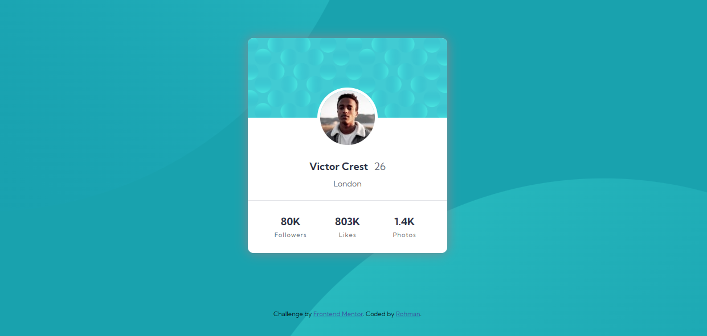

# Frontend Mentor - Profile card component solution

This is a solution to the [Profile card component challenge on Frontend Mentor](https://www.frontendmentor.io/challenges/profile-card-component-cfArpWshJ). Frontend Mentor challenges help you improve your coding skills by building realistic projects. 

## Table of contents

- [Overview](#overview)
  - [The challenge](#the-challenge)
  - [Screenshot](#screenshot)
  - [Links](#links)
- [My process](#my-process)
  - [Built with](#built-with)
  - [What I learned](#what-i-learned)
  - [Continued development](#continued-development)
  - [Useful resources](#useful-resources)
- [Author](#author)
- [Acknowledgments](#acknowledgments)

## Overview

### The challenge

- Build out the project to the designs provided

### Screenshot




### Links

- Solution URL: [Github repo](https://github.com/Hade21/profile-card-component)
- Live Site URL: [Github page](https://hade21.github.io/profile-card-component)

## My process

### Built with

- HTML5 markup
- CSS custom properties
- Flexbox
- CSS Grid
- Mobile-first workflow

### What I learned

Use this section to recap over some of your major learnings while working through this project. Writing these out and providing code samples of areas you want to highlight is a great way to reinforce your own knowledge.

To see how you can add code snippets, see below:

```html
      <div class="background">
        
      </div>
```
```css
body{
    background-color: hsl(185, 75%, 39%);
    background-image: url('./images/bg-pattern-top.svg'), url('./images/bg-pattern-bottom.svg');
    background-position: left -40em top -60em, right -28em bottom -70em;
    background-size: cover, cover;
    background-repeat: no-repeat, no-repeat;
}
```

## Author

- Frontend Mentor - [@Hade21](https://www.frontendmentor.io/profile/hade21)
- LinkedIn - [@Muhammad Abdurrohman](https://www.linkedin.com/in/muhammad-a-589675141/)
